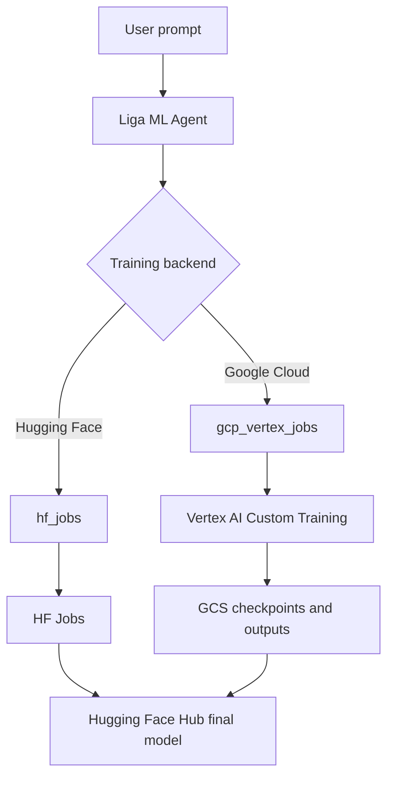

<p align="center">
  
</p>

# Liga ML Intern

An ML intern that autonomously researches, writes, and ships good quality ML related code using the Hugging Face ecosystem — with deep access to docs, papers, datasets, and cloud compute.

## Quick Start

For single-container Docker or Cloud Run-style client deployment across
Hugging Face Jobs, Google Cloud Vertex AI, and AWS SageMaker AI, see
[`docs/docker-deployment.md`](docs/docker-deployment.md).

### Installation

```bash
git clone git@github.com:Tushar7012/Liga_ML.git
cd Liga_ML
uv sync
uv tool install -e .
```

#### That's it. Now `ml-intern` works from any directory:

```bash
ml-intern
```

Create a `.env` file in the project root (or export these in your shell):

```bash
HF_TOKEN=<your-hugging-face-token>
GITHUB_TOKEN=<github-personal-access-token>
ML_INTERN_DEFAULT_MODEL_ID=moonshotai/Kimi-K2.6
ML_INTERN_KPIS_DISABLED=1
BACKGROUND_RUNS_ENABLED=false
RUN_WORKER_MODE=disabled
USAGE_DASHBOARD_ENABLED=true
AUDIT_TIMELINE_ENABLED=true
AUDIT_EVENT_RETENTION_DAYS=30
DEFAULT_DAILY_BUDGET_USD=
DEFAULT_MONTHLY_BUDGET_USD=
HF_DAILY_BUDGET_USD=
GCLOUD_DAILY_BUDGET_USD=
AWS_DAILY_BUDGET_USD=

# Optional: durable web sessions for hosted/Cloud Run deployments
MONGODB_URI=<mongodb-connection-string>

# Optional: enable Google Cloud Vertex AI training
GOOGLE_CLOUD_PROJECT=<your-gcp-project-id>
GOOGLE_CLOUD_REGION=us-central1
GCS_BUCKET=<your-training-bucket-name>
VERTEX_AI_STAGING_BUCKET=gs://<your-training-bucket-name>/vertex-staging
VERTEX_AI_OUTPUT_DIR=gs://<your-training-bucket-name>/vertex-outputs

# Optional: enable AWS SageMaker AI training
AWS_REGION=<your-aws-region>
AWS_S3_BUCKET=<your-training-bucket-name>
AWS_S3_PREFIX=liga-ml
AWS_SAGEMAKER_ROLE_ARN=<your-sagemaker-execution-role-arn>
AWS_SAGEMAKER_TRAINING_IMAGE_URI=<your-training-image-uri>
AWS_DEFAULT_INSTANCE_TYPE=ml.g5.xlarge
AWS_DEFAULT_INSTANCE_COUNT=1
AWS_DEFAULT_MAX_RUN_SECONDS=7200
AWS_OUTPUT_POLICY=aws-private
```

If no `HF_TOKEN` is set, the CLI will prompt you to paste one on first launch. To get a GITHUB_TOKEN follow the tutorial [here](https://docs.github.com/en/authentication/keeping-your-account-and-data-secure/managing-your-personal-access-tokens#creating-a-fine-grained-personal-access-token).

The hosted UI includes a Usage/Billing dashboard for HF Jobs, Vertex AI,
SageMaker AI, and agent model usage. It uses approval estimates, conservative
provider pricing metadata, and run events; it does not require live billing APIs
or add payment subscriptions. See [`docs/usage-dashboard.md`](docs/usage-dashboard.md).

The hosted UI also includes an internal Audit Timeline for session, dataset,
approval, provider job, result, usage, and error history. It uses the same
durable run/usage records, redacts secret-like metadata, and does not export to
external observability vendors. See [`docs/audit-timeline.md`](docs/audit-timeline.md).

When no uploaded dataset is attached, Liga ML can produce a no-upload Dataset
Discovery recommendation before training approval. It extracts dataset intent,
ranks safe public candidates, explains license/privacy/schema risks, persists
the latest result in session/run state, and keeps Kaggle excluded as future work.
See [`docs/dataset-discovery.md`](docs/dataset-discovery.md).

The training planner uses a static model/provider/hardware catalog to recommend
safe defaults, cost-aware hardware, output policies, warnings, and fallbacks
before any approval-gated cloud job. See
[`docs/model-provider-selection.md`](docs/model-provider-selection.md).

Production/client deployments use a shared redaction policy for backend
persistence and frontend rendering, private-by-default sandboxes, and safe
security health diagnostics. See
[`docs/security-hardening.md`](docs/security-hardening.md).

### Usage

**Interactive mode** (start a chat session):

```bash
ml-intern
```

**Headless mode** (single prompt, auto-approve):

```bash
ml-intern "fine-tune llama on my dataset"
```

**Options:**

```bash
ml-intern --model moonshotai/Kimi-K2.6 "your prompt"
ml-intern --max-iterations 100 "your prompt"
ml-intern --no-stream "your prompt"
```

## Architecture

### Component Overview

```
┌─────────────────────────────────────────────────────────────┐
│                         User/CLI                            │
└────────────┬─────────────────────────────────────┬──────────┘
             │ Operations                          │ Events
             ↓ (user_input, exec_approval,         ↑
      submission_queue  interrupt, compact, ...)  event_queue
             │                                          │
             ↓                                          │
┌────────────────────────────────────────────────────┐  │
│            submission_loop (agent_loop.py)         │  │
│  ┌──────────────────────────────────────────────┐  │  │
│  │  1. Receive Operation from queue             │  │  │
│  │  2. Route to handler (run_agent/compact/...) │  │  │
│  └──────────────────────────────────────────────┘  │  │
│                      ↓                             │  │
│  ┌──────────────────────────────────────────────┐  │  │
│  │         Handlers.run_agent()                 │  ├──┤
│  │                                              │  │  │
│  │  ┌────────────────────────────────────────┐  │  │  │
│  │  │  Agentic Loop (max 300 iterations)     │  │  │  │
│  │  │                                        │  │  │  │
│  │  │  ┌──────────────────────────────────┐  │  │  │  │
│  │  │  │ Session                          │  │  │  │  │
│  │  │  │  ┌────────────────────────────┐  │  │  │  │  │
│  │  │  │  │ ContextManager             │  │  │  │  │  │
│  │  │  │  │ • Message history          │  │  │  │  │  │
│  │  │  │  │   (litellm.Message[])      │  │  │  │  │  │
│  │  │  │  │ • Auto-compaction (170k)   │  │  │  │  │  │
│  │  │  │  │ • Session upload to HF     │  │  │  │  │  │
│  │  │  │  └────────────────────────────┘  │  │  │  │  │
│  │  │  │                                  │  │  │  │  │
│  │  │  │  ┌────────────────────────────┐  │  │  │  │  │
│  │  │  │  │ ToolRouter                 │  │  │  │  │  │
│  │  │  │  │  ├─ HF docs & research     │  │  │  │  │  │
│  │  │  │  │  ├─ HF repos, datasets,    │  │  │  │  │  │
│  │  │  │  │  │  jobs, papers           │  │  │  │  │  │
│  │  │  │  │  ├─ GitHub code search     │  │  │  │  │  │
│  │  │  │  │  ├─ Sandbox & local tools  │  │  │  │  │  │
│  │  │  │  │  ├─ Planning               │  │  │  │  │  │
│  │  │  │  │  └─ MCP server tools       │  │  │  │  │  │
│  │  │  │  └────────────────────────────┘  │  │  │  │  │
│  │  │  └──────────────────────────────────┘  │  │  │  │
│  │  │                                        │  │  │  │
│  │  │  ┌──────────────────────────────────┐  │  │  │  │
│  │  │  │ Doom Loop Detector               │  │  │  │  │
│  │  │  │ • Detects repeated tool patterns │  │  │  │  │
│  │  │  │ • Injects corrective prompts     │  │  │  │  │
│  │  │  └──────────────────────────────────┘  │  │  │  │
│  │  │                                        │  │  │  │
│  │  │  Loop:                                 │  │  │  │
│  │  │    1. LLM call (litellm.acompletion)   │  │  │  │
│  │  │       ↓                                │  │  │  │
│  │  │    2. Parse tool_calls[]               │  │  │  │
│  │  │       ↓                                │  │  │  │
│  │  │    3. Approval check                   │  │  │  │
│  │  │       (jobs, sandbox, destructive ops) │  │  │  │
│  │  │       ↓                                │  │  │  │
│  │  │    4. Execute via ToolRouter           │  │  │  │
│  │  │       ↓                                │  │  │  │
│  │  │    5. Add results to ContextManager    │  │  │  │
│  │  │       ↓                                │  │  │  │
│  │  │    6. Repeat if tool_calls exist       │  │  │  │
│  │  └────────────────────────────────────────┘  │  │  │
│  └──────────────────────────────────────────────┘  │  │
└────────────────────────────────────────────────────┴──┘
```

### Agentic Loop Flow

```
User Message
     ↓
[Add to ContextManager]
     ↓
     ╔═══════════════════════════════════════════╗
     ║      Iteration Loop (max 300)             ║
     ║                                           ║
     ║  Get messages + tool specs                ║
     ║         ↓                                 ║
     ║  litellm.acompletion()                    ║
     ║         ↓                                 ║
     ║  Has tool_calls? ──No──> Done             ║
     ║         │                                 ║
     ║        Yes                                ║
     ║         ↓                                 ║
     ║  Add assistant msg (with tool_calls)      ║
     ║         ↓                                 ║
     ║  Doom loop check                          ║
     ║         ↓                                 ║
     ║  For each tool_call:                      ║
     ║    • Needs approval? ──Yes──> Wait for    ║
     ║    │                         user confirm ║
     ║    No                                     ║
     ║    ↓                                      ║
     ║    • ToolRouter.execute_tool()            ║
     ║    • Add result to ContextManager         ║
     ║         ↓                                 ║
     ║  Continue loop ─────────────────┐         ║
     ║         ↑                       │         ║
     ║         └───────────────────────┘         ║
     ╚═══════════════════════════════════════════╝
```

## Events

The agent emits the following events via `event_queue`:

- `processing` - Starting to process user input
- `ready` - Agent is ready for input
- `assistant_chunk` - Streaming token chunk
- `assistant_message` - Complete LLM response text
- `assistant_stream_end` - Token stream finished
- `tool_call` - Tool being called with arguments
- `tool_output` - Tool execution result
- `tool_log` - Informational tool log message
- `tool_state_change` - Tool execution state transition
- `approval_required` - Requesting user approval for sensitive operations
- `turn_complete` - Agent finished processing
- `heartbeat` - Streaming connection is still alive while the agent works
- `error` - Error occurred during processing
- `stream_error` - Streaming failed with request/session identifiers for retry
- `interrupted` - Agent was interrupted
- `compacted` - Context was compacted
- `undo_complete` - Undo operation completed
- `shutdown` - Agent shutting down

## Development

### Adding Built-in Tools

Edit `agent/core/tools.py`:

```python
def create_builtin_tools() -> list[ToolSpec]:
    return [
        ToolSpec(
            name="your_tool",
            description="What your tool does",
            parameters={
                "type": "object",
                "properties": {
                    "param": {"type": "string", "description": "Parameter description"}
                },
                "required": ["param"]
            },
            handler=your_async_handler
        ),
        # ... existing tools
    ]
```

### Adding MCP Servers

Edit `configs/cli_agent_config.json` or `configs/frontend_agent_config.json`:

```json
{
  "model_name": "moonshotai/Kimi-K2.6",
  "mcpServers": {
    "your-server-name": {
      "transport": "http",
      "url": "https://example.com/mcp",
      "headers": {
        "Authorization": "Bearer ${YOUR_TOKEN}"
      }
    }
  }
}
```

Note: Environment variables like `${YOUR_TOKEN}` are auto-substituted from `.env`.

## Docker And Cloud Run Deployment

The production container serves the FastAPI backend and built frontend on
`0.0.0.0:$PORT`, defaulting to port `8080`. Build and run locally with:

```bash
docker build -t liga-ml:all-providers .
docker run --rm --env-file .env -p 8080:8080 liga-ml:all-providers
```

Or use Compose:

```bash
docker compose --env-file .env up --build
```

Cloud Run should use at least 2 GiB memory, 2 CPU, a 3600 second timeout,
concurrency around 20, port `8080`, Secret Manager for `OPENAI_API_KEY`,
`HF_TOKEN`, `HUGGINGFACE_HUB_TOKEN`, `GITHUB_TOKEN`, `AWS_ACCESS_KEY_ID`,
`AWS_SECRET_ACCESS_KEY`, and optional `AWS_SESSION_TOKEN`, plus normal env vars
for non-secret provider configuration. Local development keeps
`BACKGROUND_RUNS_ENABLED=false` and `RUN_WORKER_MODE=disabled` for the old chat
flow. Cloud Run production sets `BACKGROUND_RUNS_ENABLED=true` and
`RUN_WORKER_MODE=in_process` to use the Phase 1 durable session/event replay
path when MongoDB is configured. `RUN_WORKER_MODE=external_worker` is reserved
and not implemented yet. Set `SESSION_TOKEN_ENCRYPTION_KEY` before any future
encrypted token handoff is enabled; Phase 1 does not persist provider tokens in
the run ledger. See `docs/background-runs.md` for the run APIs and replay model.
Post-training evaluation is static and cost-free by default:
`POST_TRAINING_EVAL_ENABLED=true`, `POST_TRAINING_EVAL_MODE=static`, and
`POST_TRAINING_EVAL_USE_PAID_JUDGE=false`. It reviews completed training metadata
and metrics without loading models or calling live endpoints; see
[`docs/post-training-evaluation.md`](docs/post-training-evaluation.md).
Do not use
`GOOGLE_APPLICATION_CREDENTIALS` for Cloud Run production; attach an appropriate
service account instead. Never commit `.env`, credential files, local datasets,
`.playwright-mcp`, caches, or generated artifacts.

After deployment, verify without launching paid jobs:

```bash
curl "$SERVICE_URL/api/health"
curl "$SERVICE_URL/api/health/providers"
curl "$SERVICE_URL/"
```

The provider health endpoint reports non-secret readiness for Hugging Face Jobs,
Google Cloud Vertex AI, and AWS SageMaker AI.

## Google Cloud Vertex AI Training

Liga ML can run training on either Hugging Face Jobs or Google Cloud Vertex AI. Hugging Face remains the common model registry: whether a model is trained on HF compute or Vertex AI, the final successful model should be pushed back to Hugging Face Hub.

For production Cloud Run and Vertex AI setup, see [Google Cloud deployment](docs/google-cloud-deployment.md) and [GCloud merge readiness](docs/gcloud-merge-readiness.md). For the senior fine-tuning planner readiness checklist, see [Senior Fine-Tuning Planner merge readiness](docs/senior-finetune-planner-readiness.md). Local validation helpers live at [`scripts/check_gcp_readiness.py`](scripts/check_gcp_readiness.py) and [`scripts/gcloud_vertex_dry_run.py`](scripts/gcloud_vertex_dry_run.py).

### Workflow



### Required GCP Configuration

Set these on Cloud Run, or locally in `.env` for development:

```bash
GOOGLE_CLOUD_PROJECT=<your-gcp-project-id>
GOOGLE_CLOUD_REGION=us-central1
GCS_BUCKET=<your-training-bucket-name>
VERTEX_AI_STAGING_BUCKET=gs://<your-training-bucket-name>/vertex-staging
VERTEX_AI_OUTPUT_DIR=gs://<your-training-bucket-name>/vertex-outputs
```

For Cloud Run, prefer an attached service account instead of a JSON key. The service account needs:

```text
roles/aiplatform.user
roles/storage.objectAdmin
roles/logging.viewer
roles/artifactregistry.reader
```

If Vertex jobs run as a separate service account, also grant:

```text
roles/iam.serviceAccountUser
```

Enable these APIs in the GCP project:

```text
Vertex AI API
Cloud Storage API
Cloud Logging API
Artifact Registry API
Cloud Build API
```

### Example Prompt

```text
Fine-tune a model for Indian GST notice classification using Google Cloud Vertex AI. Save checkpoints to GCS and push the final model to Hugging Face Hub.
```

## AWS SageMaker Training

AWS SageMaker support is deployment-gated behind explicit AWS environment, IAM, S3, and training image configuration. See [AWS SageMaker deployment](docs/aws-sagemaker-deployment.md) and [AWS merge readiness](docs/aws-merge-readiness.md). Local validation helpers live at [`scripts/check_aws_readiness.py`](scripts/check_aws_readiness.py) and [`scripts/aws_sagemaker_dry_run.py`](scripts/aws_sagemaker_dry_run.py).

## License

MIT License
